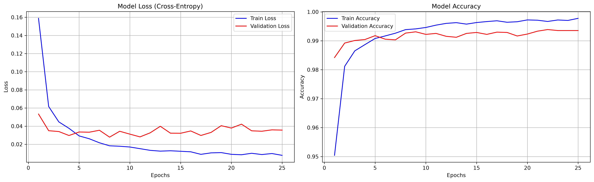
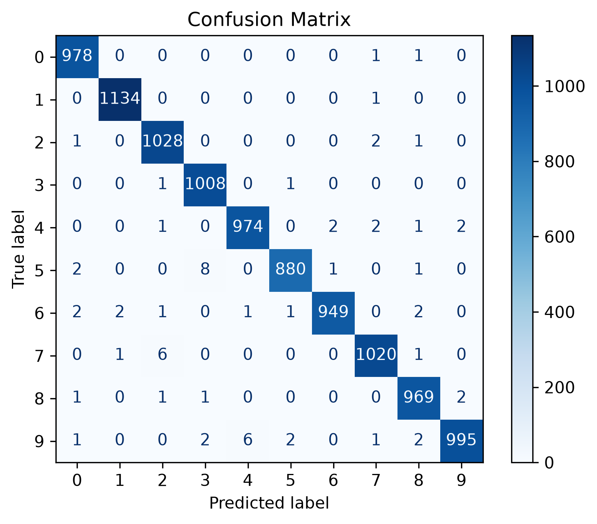
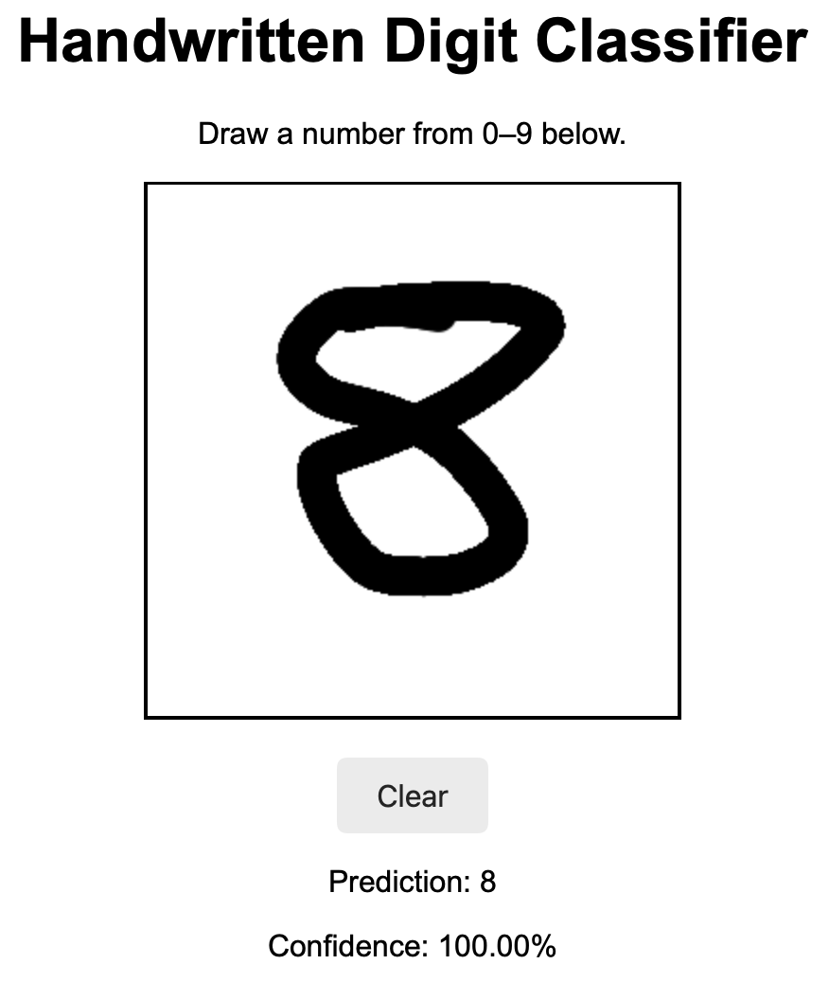

# MNIST Handwritten Digit Classification

## Goal

Build and train a convolutional neural network (CNN) to classify  `28 × 28` grayscale images of handwritten digits from `0` to `9`.

The trained model is also integrated into an interactive web application where users can draw a digit using their cursor and receive a prediction from the model.

The application uses:

- PyTorch for the CNN and inference pipeline
  FastAPI for the backend prediction API
- HTML, CSS, and JavaScript for the interactive drawing interface

## Dataset

The MNIST dataset contains 70,000 labeled handwritten digit images:

- 60,000 training images
- 10,000 testing images

The original test set was kept separate and used only after the final model configuration was selected.

## Model Architecture

The CNN contains:

- Three convolutional layers with ReLU activation
- Two max-pooling layers
- A fully connected classifier
- Two dropout layers with `p=0.25`
- A final output layer containing 10 classes

Dropout was added to reduce overfitting and improve generalization.

## Data Split

The original 60,000-image training set was divided into training and validation subsets using the `validation_set()` function.

- Training set: 85%
- Validation set: 15%
- Test set: Original 10,000 MNIST test images

## Baseline Model

The file `base_model.ipynb` contains the original baseline CNN.

The baseline model achieved approximately 99.2% validation accuracy, but its training curves showed signs of overfitting.

## Model Experiments

Several model configurations and hyperparameters were tested individually and in combination.

Experiments included:

- Dropout with different probabilities
- Batch normalization
- Different learning rates
- Dropout combined with batch normalization

The final model was selected using validation loss and validation accuracy.

## Best Model Checkpoint

During training, the model weights from the epoch with the lowest validation loss were saved and restored before final evaluation.

This prevents the final model from automatically using the weights from the last training epoch when an earlier epoch performed better.

## Results

On the untouched MNIST test set, the final model achieved:

- **Accuracy: ~99.41%**
- **Macro Precision: ~99.4%**
- **Macro Recall: ~99.4%**
- **Macro F1 Score: ~99.4%**
- **59 incorrect predictions out of 10,000 test images**

### Training Performance

  

### Confusion Matrix

  

## Interactive Web Application

The trained CNN was integrated into an interactive browser application.

Users can:

- Draw a handwritten digit on a canvas
- Receive an automatically generated prediction
- View the model's confidence score
- Clear the canvas and draw another digit

The browser converts the drawing into an image and sends it to a FastAPI `/predict` endpoint. The backend preprocesses the image into the same `28 × 28` format used during training before passing it through the CNN.

### Application Preview

  

## Project Structure
number_classification/
│
├── backend/
│   ├── `app.py`  FastAPI backend
│   ├── `inference.py`  image preprocessing and prediction logic
│   ├── `model.py`  CNN architecture used for inference
│   └── best_cnn_model.pth
│
├── frontend/
│   ├── `index.html` - application interface
│   ├── `script.js` - drawing and prediction behavior
│   └── `style.css` - interface styling
│
├── images/
│   ├── model_loss.png
│   ├── model_accuracy.png
│   ├── confusion_matrix.png
│   └── app_preview.png
│
├── `base_model.ipynb` - original baseline CNN
├── `cnn_analysis.ipynb` - model analysis, experiments, plots, and results
├── `cnn.py` - complete CNN training and evaluation pipeline
├── `best_cnn_model.pth` - saved parameters from the best model checkpoint
└── `README.md`
